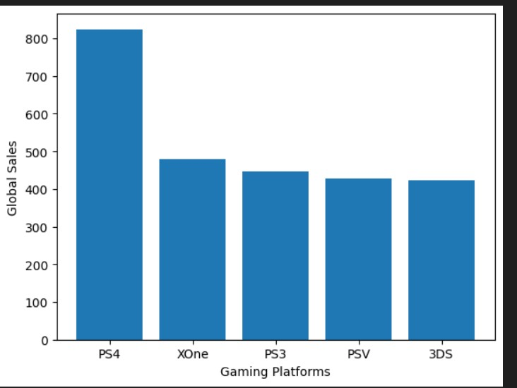
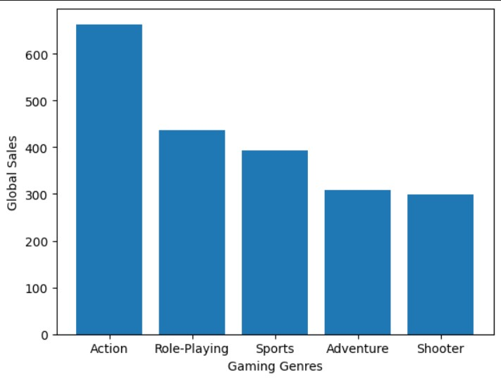
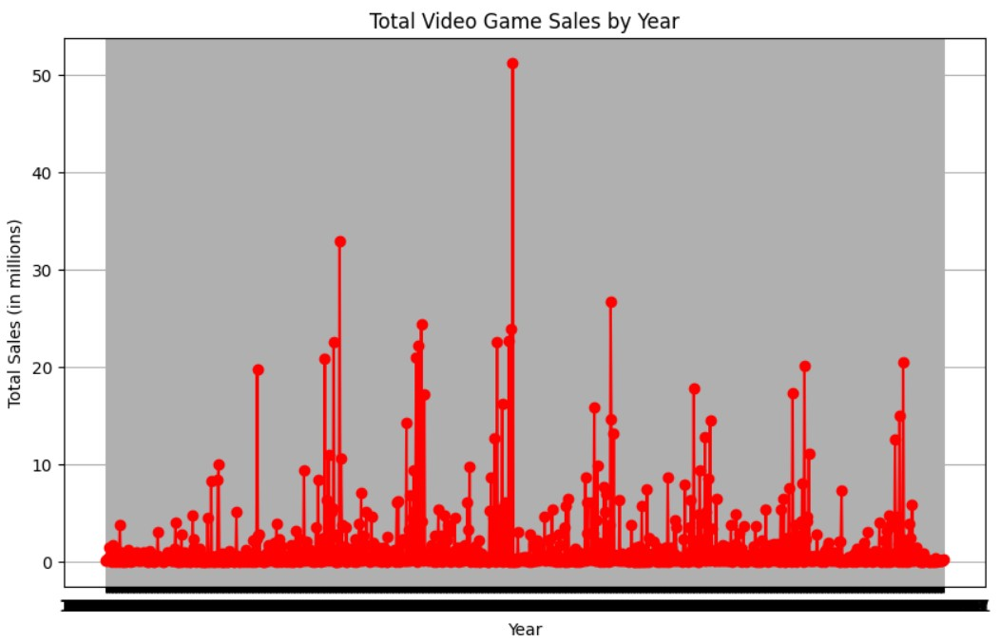

# Gaming Industry Analysis of last 40 years
A Data Analysis of a Video-Game Industry Dataset

-----------------------------------------------------------------------------------------------------------------------------------------------------------------------------------
## Requirements for the project
The project has been done in the Jupyter enviroment coded in Python . All the required packages and libraries have been mentioned in requirement.txt for your referal.

The data file would contain 2 files and one of them will have the 'improved' tag, this dataset consists a modified version of the orignal dataset wherein I have searched for the missing publisher column values.

-----------------------------------------------------------------------------------------------------------------------------------------------------------------------------------
## Motivation
This project was a part of Gaming Industry. Here i had  to select a dataset, come up with some questions and answer them through data analysis of the dataset, and post their findings through a blogpost. The dataset I chose is present on [[Kaggle](https://www.kaggle.com/datasets/gregorut/videogamesales), representing gaming industry information from 1984-2024 in reference to the video-game titles that have been released. The code answer's the following questions:
* Which Genre has become most popular?
* Which Platform has been the most popular to play games on?
* How the Sales Trend for games has been for the past 40 years?
* Publishers with most Global Sales along with which country offers the maximum of these sales?

-----------------------

-----------------------

